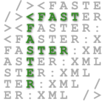
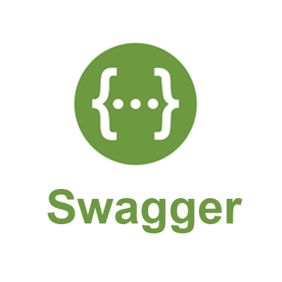
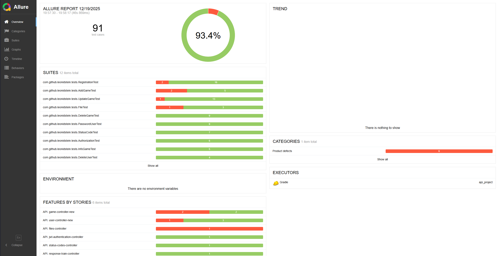
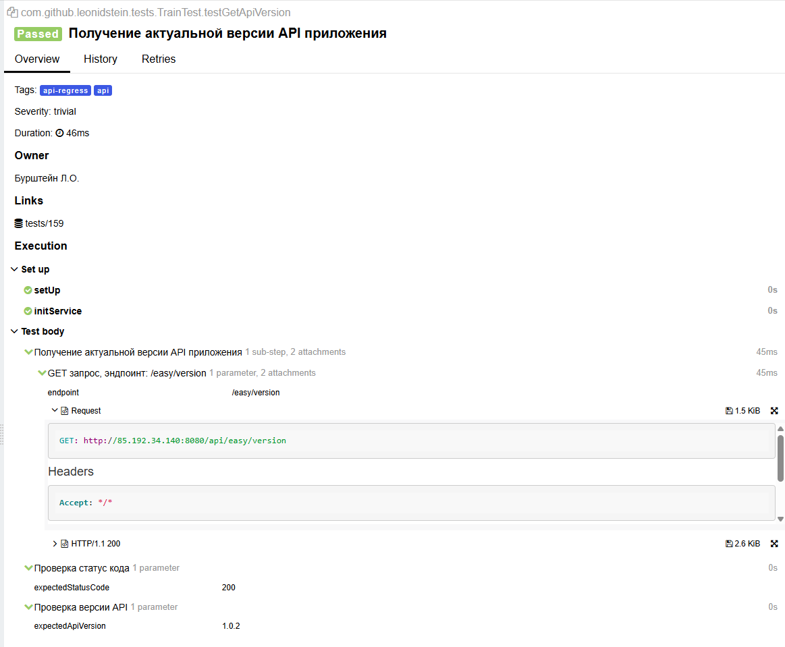
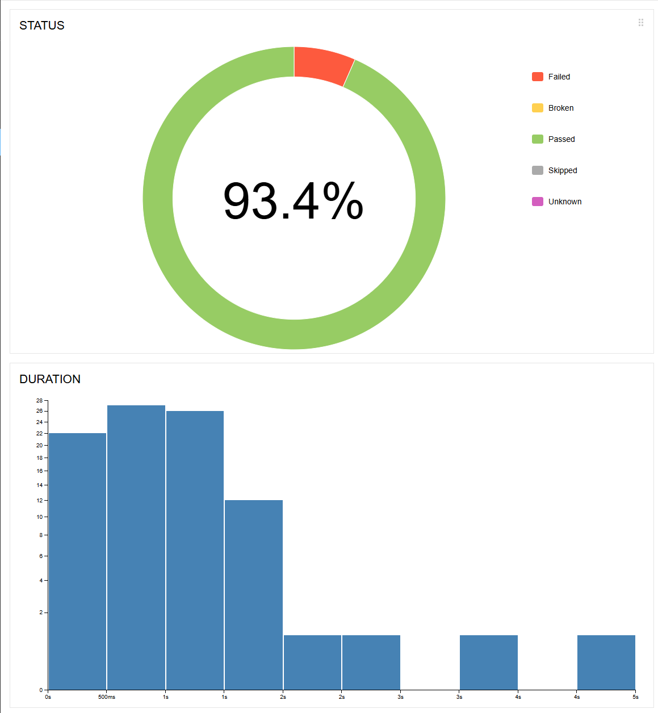
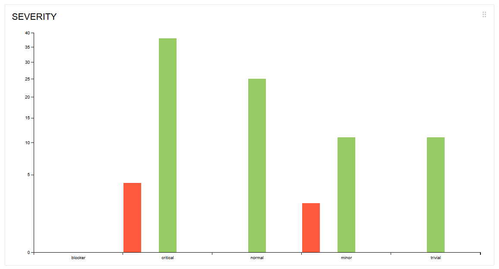
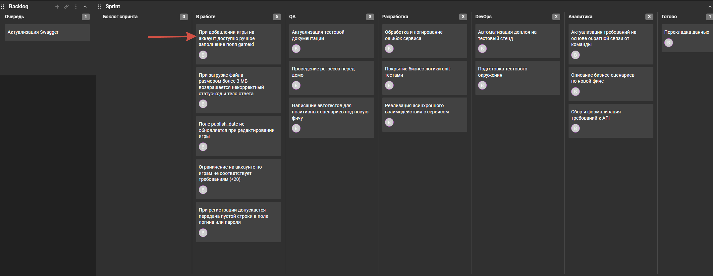
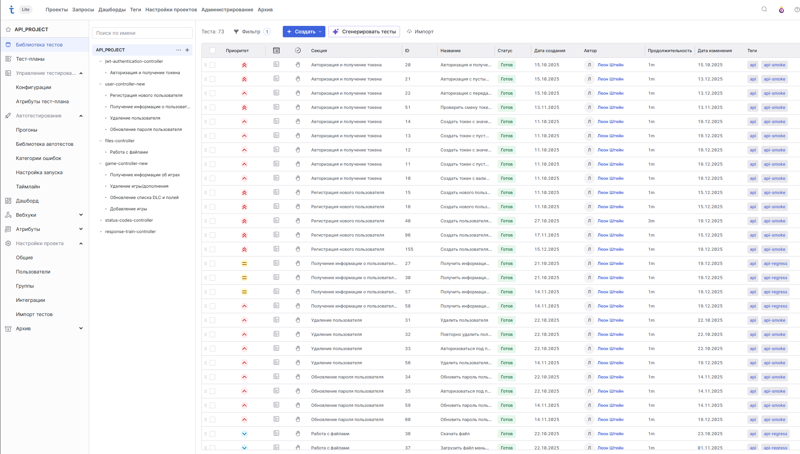

# Проект по автоматизации тестирования API

____

## **Содержание:**

* <a href="#aboutproject">О проекте</a>

* <a href="#tools">Технологии и инструменты</a>

* <a href="#swagger">Swagger UI</a>

* <a href="#console">Запуск тестов</a>

* <a href="#ci">Принцип работы GitHub Actions</a>

* <a href="#allure">Allure отчёт</a>

* <a href="#kaiten">Управление задачами</a>

* <a href="#checklist">Чек листы</a>

----
<a id="aboutproject"></a>

## <a name="О проекте">**О проекте:**</a>

В проекте используется современный стек для автоматизации тестирования **REST API**.

Тесты написаны на **Java** с применением **JUnit 5** и **Rest Assured**.  
Для работы с API используются собственные **обёртки**, упрощающие отправку запросов, обработку ответов и повторное
использование логики.

Сборка и управление зависимостями осуществляется с помощью **Gradle**.  
Для формирования наглядных отчётов о результатах тестирования используется **Allure**.

Конфигурация тестового окружения реализована через библиотеку **Owner**, а работа с JSON-данными — с помощью **Jackson**.

Для упрощения кода применяется **Lombok**, проверки выполняются с использованием **AssertJ**, а тестовые данные
генерируются через **Java Faker**.

Проект разработан в **IntelliJ IDEA**, контроль версий осуществляется в **GitHub**.

Автоматический запуск тестов и проверка сборки выполняются с помощью **GitHub Actions**.

Для работы с API-документацией используется **Swagger UI**, а для управления тестовой документацией и результатами — **Test IT** и **Kaiten**.

____ 
<a id="tools"></a>

## <a name="Технологии и инструменты">**Технологии и инструменты:**</a>

<p align="center">  
<a href="https://www.jetbrains.com/idea/"></a>  
<a href="https://www.java.com/"></a>  
<a href="https://github.com/"></a>  
<a href="https://junit.org/junit5/"></a>  
<a href="https://gradle.org/"></a>
<a href="https://allurereport.org/"></a> 
<a href="https://projectlombok.org/"></a>   
<a href="https://rest-assured.io/"></a>
<a href="https://matteobaccan.github.io/owner/"></a>
<a href="https://github.com/FasterXML"></a>
<a href="https://assertj.github.io/doc/"></a>
<a href="https://github.com/DiUS/java-faker"></a>
<a href="https://swagger.io/tools/swagger-ui/"></a>
<a href="https://testit.software/"></a>
<a href="https://kaiten.ru/features/documents/"></a>
</p>

- **IntelliJ IDEA** — интегрированная среда разработки программного обеспечения.
- **Java** — основной язык программирования для разработки.
- **GitHub** — контроль версий и хранение кода проекта.
- **GitHub Actions** — автоматический запуск тестов и CI/CD процесс.
- **JUnit 5** — фреймворк для написания и запуска тестов.
- **Gradle** — система сборки, управления зависимостями и запуска тестов.
- **Allure** — генерация наглядных отчётов о выполнении тестов.
- **Lombok** — сокращение шаблонного кода через аннотации.
- **Rest Assured** — библиотека для автоматизации тестирования API.
- **Owner** — библиотека для управления конфигурациями и настройками тестового окружения.
- **Jackson** — работа с JSON: сериализация и десериализация объектов.
- **AssertJ** — удобные и читаемые assertion’ы для проверок в тестах.
- **Java Faker** — генерация случайных тестовых данных.
- **Swagger UI** — просмотр и тестирование API, документация для разработчиков.
- **Test IT** — управление тестовыми сценариями и результатами тестирования.
- **Kaiten** — управление задачами и визуализация прогресса команды.
____
<a id="swagger"></a>

## <a name="Swagger UI">**Swagger UI:**</a>

http://85.192.34.140:8080/swagger-ui/index.html#/

----
<a id="console"></a>

## <a name="Запуск тестов">**Запуск тестов:**</a>

***Локальный запуск:***

* Запуск тестов через Gradle:

```
gradle clean test                  # запускает все тесты
gradle clean apiTest               # запускает все тесты по тегу: api
gradle clean apiSmokeTest          # запускает smoke тесты по тегу: api-smoke
gradle clean apiRegressionTest     # запускает regression тесты по тегу: api-regress
```

* Запуск тестов через Gradle Wrapper:

```
./gradlew clean test               # запускает все тесты
./gradlew clean apiTest            # запускает все тесты по тегу: api
./gradlew clean apiSmokeTest       # запускает smoke тесты по тегу: api-smoke
./gradlew clean apiRegressionTest  # запускает regression тесты по тегу: api-regress
```

----
<a id="ci"></a>
## </a> <a id="allure"></a> <a name="Принцип работы GitHub Actions">**Принцип работы GitHub Actions:**</a>

**Триггеры запуска** — workflow запускается автоматически при коммите в ветки main, develop или feature, а также вручную через интерфейс GitHub с возможностью выбрать набор тестов (api, api-smoke, api-regress).

**Подготовка окружения** — GitHub Actions клонирует репозиторий, устанавливает Java 21 (JDK), настраивает кэш Gradle и задаёт права на выполнение для Gradle Wrapper.

**Запуск тестов** — при ручном запуске выполняются тесты по выбранному тегу; при автоматическом запуске по коммиту выполняются все API тесты по умолчанию. Workflow продолжает выполнение даже если тесты падают, чтобы отчет всегда формировался.

**Установка Allure CLI** — на виртуальной машине устанавливается Allure для генерации отчетов; выполняется в любом случае, даже если тесты упали.

**Генерация Allure Report** — Allure собирает результаты тестов и создаёт отчёт.

**Сохранение отчета** — сформированный Allure Report загружается как артефакт workflow и может быть скачан и просмотрен через интерфейс GitHub Actions после завершения job.

----
<a id="allure"></a>
## </a> <a id="allure"></a> <a name="Allure отчёт">**Allure отчёт:**</a>

#### Все запуски автотестов сопровождаются формированием Allure-отчёта, который используется для анализа результатов тестирования, выявления дефектов и контроля качества сборок.

### *Основная страница отчёта:*

<p align="center">  
  
</p>  

### *Пример тестового отчёта:*

<p align="center">  

</p>

### *Графики:*

<p align="center">  


  
</p>

----
<a id="kaiten"></a>
## </a> <a id="allure"></a> <a name="Управление задачами">**Управление задачами:**</a>
#### По результатам выполнения автотестов и анализа отчёта Allure были заведены баг-репорты в Kaiten. Также была смоделирована работа спринта.
<p align="center">  

</p>

----
<a id="checklist"></a>

## </a> <a id="checklist"></a> <a name="Чек листы">**Чек листы:**</a>

#### Все автотесты в проекте сопровождаются чек-листами, созданными в Test IT. Это позволяет наглядно отслеживать покрытие функциональности автотестами и поддерживать актуальность тестовой документации.

<p align="center">  

</p>
